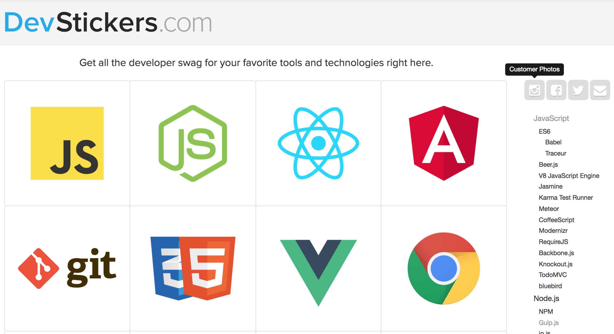
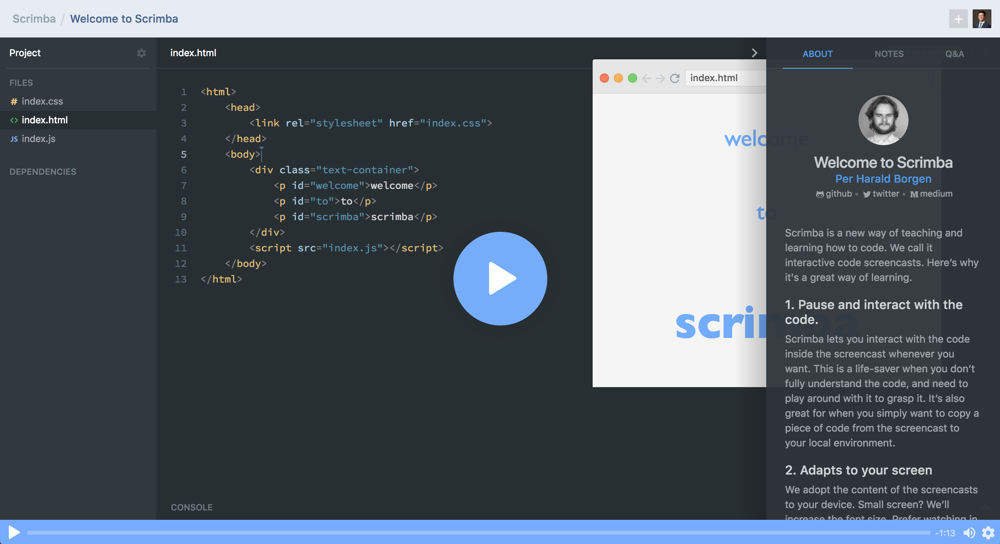
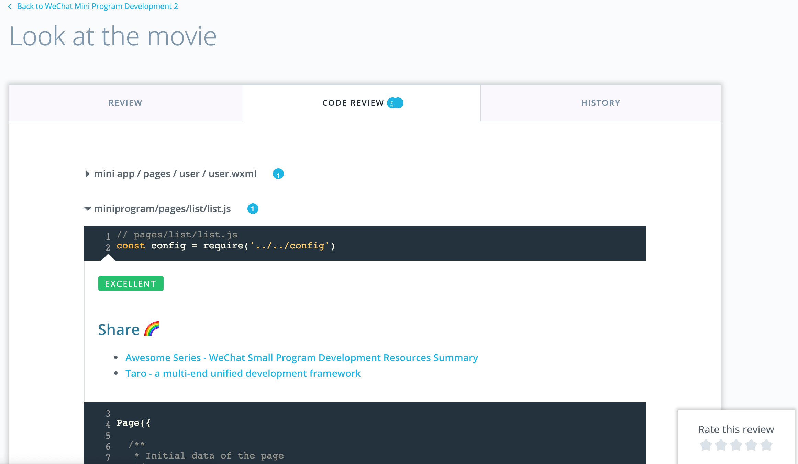
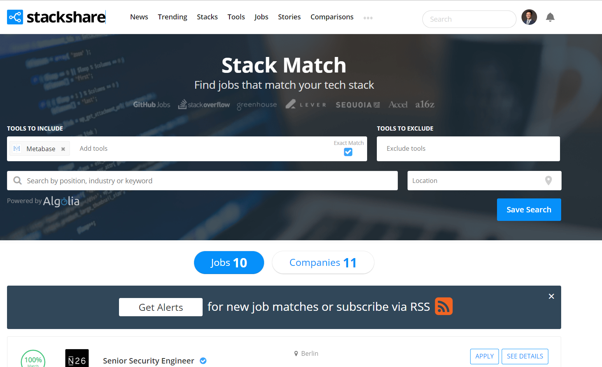
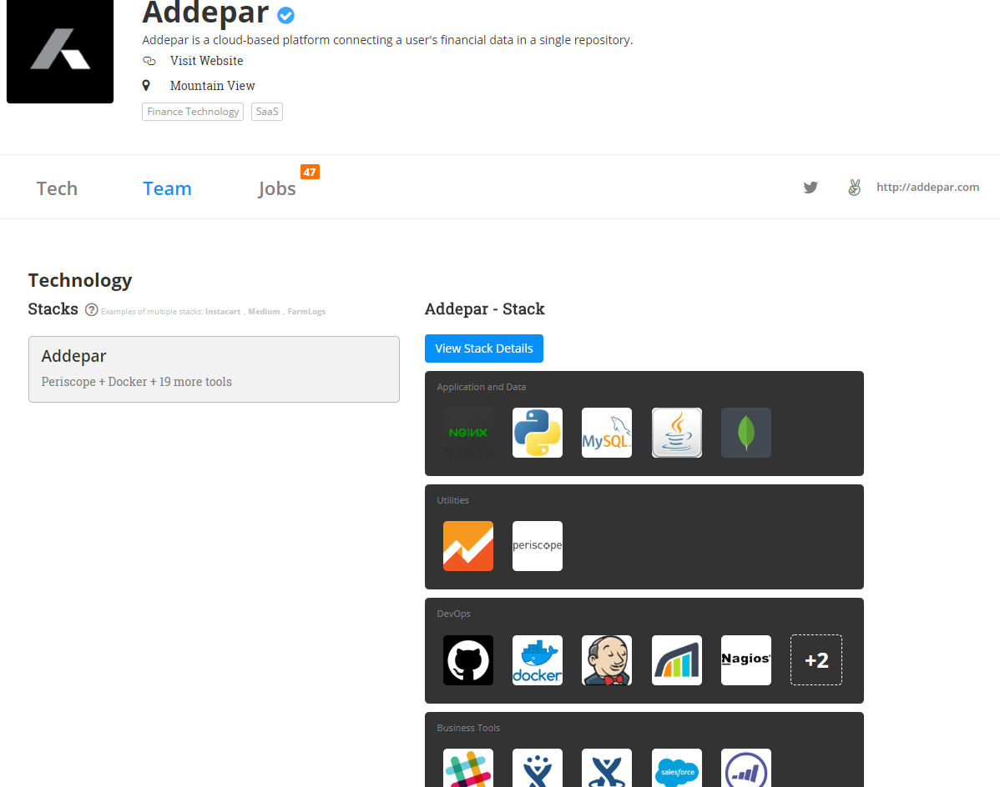
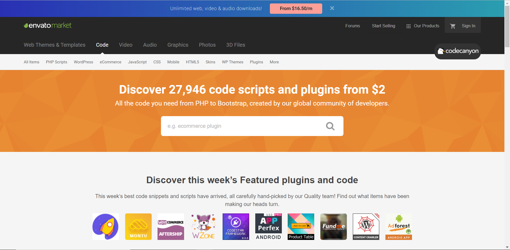
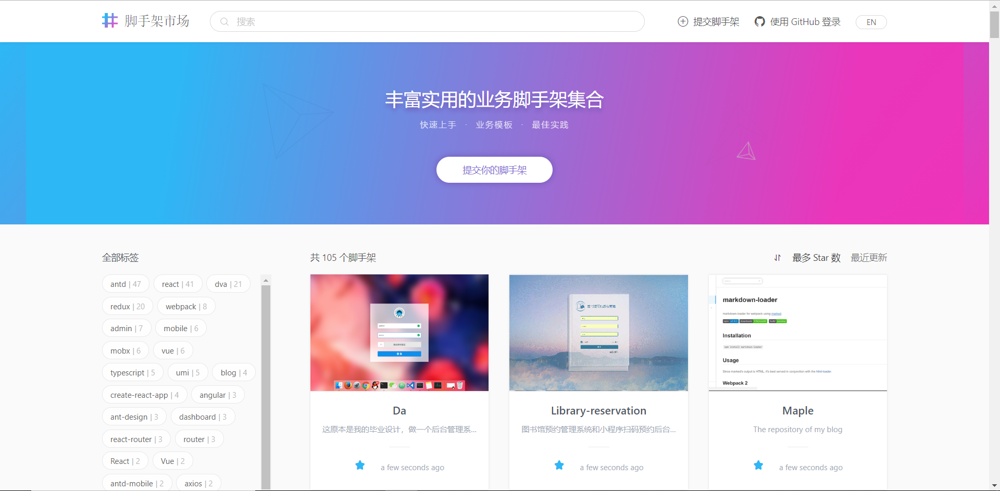

# Chapter 1 Coding
All the ideas below are related with computer programming and programmer.

Here are some basic statistics about this market:

1. Programmer Population: China grows super fast, data from [this article](https://www.computerworld.com/article/2483690/it-careers/india-to-overtake-u-s--on-number-of-developers-by-2017.html).
    1. Worldwide: [2013]18.2 million, [2019]26.4 million, 45% increase
    1. China: [2013]1.9 million, [2017][5 million](https://www.jianshu.com/p/273e0ad7ea8f), **163% increase**
    2. India: [2013]2.75 million, [2018]5.2 million, 90% increase
    3. US: [2013]3.6 million, [2018]4.5 million, 25% increase
    4. Russian: [2013]1.3 million

## 1. DevStickers in China
[DevStickers](https://devstickers.com/) is a marketplace that sells stickers and t-shirts for Web Developer's favorite tools and technologies. According to my current awareness, there is currently no such marketplace in China.



As more 90s and 00s becoming programmers, products and accessories that demonstrate personality will be in good sale.

### Successful Determinants
Overall market size is relatively small. Finding the main user groups could be tough.

### Suggested Procedure
1. Do the market research on DevStickers's most popular products. Programming languages are universal, it is very likely the popularity is similar in China. Also, the customer segmentation could be quite similar. So at least after the research, you will have a short-list of your initial products and user groups. I bet React and Vue will top the list.
2. Pick print-on-demand drop-shipping supplier. Not like in the US market where you can find a bundle of mature suppliers like Gooten and Printful, there is few trustworthy supplier in China. I would only recommend [EASYPNP](http://easypnp.com/) as they are the best in on-demand printing in China. Also, seriously consider if you would like to stock some inventories using oversea suppliers for initial stages to get rid of the communication barrier with domestic supplier.
3. Create your brand. Choose your brand name wisely, better with a Chinese meaning.
3. Register a WeChat Public Account for your brand using [this link](https://mp.weixin.qq.com/?lang=en_US).
4. Start your online store on Alibaba Taobao following [this procedure](https://world.taobao.com/helper/knowledge.htm?kid=6563218). Taobao is the largest Chinese C2C e-commerce platform with 448 million monthly-active users (MAU). **Building a Shopify-liked e-commerce website from scratch is not the best choice in China, as customers are more used to shopping on platforms.**
4. Recruit your first several users and give them free sample for feedback. You can try:
    1. Give free sample to your connections in China
    2. Cold call/email Chinese programmers using LinkedIn
5. Promote your product on largest Chinese programmer communities with advertisement and event-sponsorship. You might need a Chinese-speaking partner like:
    1. [OSChina](https://www.oschina.net/)
    2. [SegmentFault](https://segmentfault.com/)
    3. [CSDN](https://www.csdn.net/)
    4. [Juejin](https://juejin.im/)
6. Find business consumers and be their supplier. For decoration purpose, they will have enough paying willingness. Including:
    1. Co-working Spaces
    2. Tech-driven Startups

## 2. Coding Live Broadcasting
Learning to write code could be a tough process, especially for newbies with no idea how to start the text editor and they are taught to write a for-loop. Even for more experienced programmers who want to enhance their design pattern, they may find no study path to learn from the coding habit of top programmers. Coding live broadcasting could be a solution.


I have seen non-Chinese famous programmers broadcasting coding on Twitch.tv and Youtube, but no such things are well-known among Chinese programmer community. Imagine you turn on the live broadcasting while coding for a job or a project and generate passive income with almost zero operating cost except audience advisory. You could even publish your coding record into video lectures and make recursive money.

As long as you could persuade the audience that you are a strong programmer, whatever the clue that you work for FANG or you are the BDFL of pandas, Chinese programmer would love to pay for learning from you. It is a win-win situation.

### Successful Determinants
The quality of your broadcasting.

### Suggested Procedure
1. Self capability assessment. If you are already a renowned programmer, then you could jump to step 3. Otherwise, you need to recruit your broadcasting hosts.
2. Recruit hosts. Find renowned programmers using GitHub and write cold emails to them about this idea. You will get a lot of rejections before several say 'Yes'. Here is [a starter list](https://medium.com/swlh/learn-to-code-with-live-streams-from-the-best-developers-932dcfdbb87) I found from Medium.
3. Register a broadcasting account on [Douyu](https://www.douyu.com/) using [this link](https://www.douyu.com/special/guide/anchor), the largest broadcasting platform in China. You might need a Chinese speaking partner to help you go over the registration process mainly in Chinese.
3. Register a WeChat Public Account for your brand using [this link](https://mp.weixin.qq.com/?lang=en_US).
4. Recruit your first several users from:
    1. Coding tutorial websites like [Liaoxuefeng](https://www.liaoxuefeng.com/) and [Runoob](http://www.runoob.com/) by advertisements.
    2. Personal connections
5. Scale it up with fast iteration based on user feedback. Be sure always to serve what the programmers needed.

## 3. Scrimba in China
[Scrimba](https://scrimba.com/) is a new way of teaching and learning how to code. We call it interactive code screencasts, which allows user to play around with the instructors code any time, right in the player. By the end of 2018, Scrimba is still in its beta version without a payment option. Given that the Scrimba repository (if they use GitHub to manage their repository) is not public visible, I guess they will monetize the platform after beta.



According to my current awareness, there is no such platform in China.

### Successful Determinants
The proprietary technology stack that builds the Scrimba-like interactive player.

### Suggested Procedure
1. Inspect Scrimba. Use the Chrome `inspect` function and try to figure out how it works. You will need to have an advanced knowledge in JavaScript.
2. Lobby with Scrimba. Negotiate and try to cooperate as their Chinese agent. If rejected, at least make sure you grasp some useful fraction of building a similar platform.
3. Build the prototype. This is the hardest part.
4. Introduce your prototype to:
    1. MOOC (Massive Online Open Course) platforms
        1. [163 Study](https://study.163.com/)
        2. [Tecent Classroom](https://ke.qq.com/)
    2. Coding tutorial websites
        1. [Liaoxuefeng](https://www.liaoxuefeng.com/)
        2. [Runoob](http://www.runoob.com/)
5. Develop an eye-catching course to drive original traffic. The topic should be related with a mainstream demand and without strong competition. For example, Srimba published [`Neural Network in JavaScript`](https://scrimba.com/g/gneuralnetworks).

## 4. Code Review On-demand Platform
This idea is inspired from the code review process of Udacity's Project and has a potential to operate globally.



There are multiple levels of programmers, the upgrade of one level always means a magnitude of hard effort. Based on the Dunning–Kruger effect, only the Basic and Extraordinary programmers are the happiest. Extraordinary programmers are masters who have overcome all major issues in coding and usually we call then the BDFL of some technology or an experienced full-stack engineer. Basic programmers are forks just be able to achieve a functionality using 'hard code' or Procedure Oriented Programming (Most even don't know what this concept means!), they are just amazed by the power of coding and have not met upfront issues like reusability.


As long as a Basic programmer dives deeper, she will not be happy that much as she comes across the concept of `Don't Repeat Yourself (DRY)`because she literally repeats herself too much. **Here is exactly where the Code Review On-demand Platform (the Platform, below) could plug-in.** Instead of randomly searching on Google for code enhancement suggestions from multiples sources like StackOverflow or documentations and manually picking useful tips themselves, Basic programmers could rely on the Platform for suggestions. By simply submitting the code through GitHub or other channels, the platform categorizes the field of your code and matches your code with an experienced reviewer who is an expert in the selected field. After check, Basic programmer gets a detailed code review report and reviewer monetizes her skills while the Platform gets cut, a win-win situation.

If you know existing automatic code review platforms on GitHub like Codacy, you may wonder why this person-to-person idea still works. Here is my attempted answer. Algorithms still cannot return creativity yet. When it comes to debugging, algorithms might be better off than human. But for design patterns and career development suggestions, algorithms still have a long way to go to surpass human.

### Successful Determinants
Find experienced code reviewers and build the Platform.

### Suggested Procedure
1. Check the Udacity Code Review process or the prototype I created. Having a deep understanding of the business logic is important.
2. Recruit supply, code reviewers from experienced programmers. Here are some places you may find them:
    1. StackOverflow, SegmentFault (Chinese StackOverflow)
    2. Personal connections
    3. GitHub: find programmers with repository that has lots of stars and forks
    4. Freelancers Websites: TopTal, UpWork
2. Recruit demand, here are some places you may find them:
    1. Your own code or your friends' code
    2. Coding starter forums: MOOC students, Udacity Nanodegree forums, Slack groups
    3. People asking questions on StackOverflow, SegmentFault, [CSDN](https://www.csdn.net/)
    4. Companies with limited code review service for internal developers including startups and big non-tech companies
3. Minimum Viable Product: Manually matches supply with demand to the point where you have to rely on a proprietary platform to handle the order volume. Fast iterates on user feedback to improve the overall process and be responsible to the Net Promoter Score (NPS) but sales.
4. Scale it up: Build the platform using the prototype below and automate. This business should be good to boom.
5. Build an App and Publish on GitHub Marketplace. Optionally, you could provide a human-inspected code review service, compares to existing algorithm-inspected services.

<!--
### Prototype
#TODO
-->

## 5. Job Search for Programmers
There are already many big players in the general job search market, such as [Lagou](https://www.lagou.com/), [51Job](https://www.51job.com/) and [Liepin](https://www.liepin.com/). There are already programmer-oriented websites that offer Job sections, such as [CSDN](https://job.csdn.net/) and [OSChina](https://job.oschina.net/).

**There is no job search service provider only for programmers.** The dedication to a children market could means professionalism, achieved through ways like:

1. allowing applicants to filter jobs by tech stack

2. displaying the tech stack of every listed company

3. including every developer job which is searchable on the Internet
4. creating self-assessment for developers to identify their skills and improve accordingly like the [PluralSight Role IQ](https://www.pluralsight.com/role-iq/react-web-developer) test
5. matching development supply with demand by algorithms (machine learning, AI)
6. integrating deeply with [GitHub](https://github.com/) as a GitHub App
7. helping the employers to find developers with right stack

### Successful Determinants
1. Getting company stack data.
1. Programmer-centered perspective. For, by, with programmers.
2. Development of Self-assessment tests.

### Suggested Procedure
1. Minimum viable product: manually matching supply with demand by stack. You should start from your existing knowledge about company stack and applicants capability. Extract the mainstream and high-frequency pain points (the Pain Points) from the manual process.
2. Shift products to handle the Pain Points, one at a time. An attempted list of products could be like:
    1. Developer Jobs Description Database: confirms the stack needed of each job, data acquisition combines web scraping with user uploads, enables:
        1. Job search by stack
        2. Company stack profile
    2. Self-assessment tests: for applicants to know where they should stack up
    3. Algorithm matching: using AI
    4. Team skill builder: A mapping tool helps you identify the skill gap between your project/startup's need and your current team setting, and automatically figures out specific job roles that are needed. I have a personal attempted solution in [this repository](https://github.com/qzcool/Startup-Team-Builder).   
3. Recruit early-adapting users.
    1. Applicants: Job Search Websites
        1. [Ying Jie Sheng](http://www.yingjiesheng.com/), for recent graduates
        2. [Lagou](https://www.lagou.com/), for Internet industry
    2. Employers: find HRs on LinkedIn, [Maimai](https://maimai.cn/) (LinkedIn copycat) and so on.
3. Scale it up. Only after your product is greatly loved by early users.
4. Monetization. The strategy could be just like other players, such as charging the employer the headhunt cut per employment.

<!---
### Prototype
#TODO
--->

## 6. Utils Package Sharing Marketplace
One of many funs of programming is that it allows you to encapsulate your frequently used scripts into a module or package called `utils` so that to reduce redundancy and increase efficiency. As our experience increases, our daily job will be more and more likely to be a combination of a 80% of your existing `utils` and a 20% of some seasoning (creativity, the uniqueness of projects).

Let us imagine if are using the `utils` from a top programmer in a narrow field, which includes a series of APIs that are well-documented and efficiency-optimized, you will definitely be more confident with that specific field that you would even not bother to pay. By creating such a utils sharing marketplace, good packages could monetize as they deserve and the overall utility of the community could improve significantly.

### Successful Determinants
1. Acquire a minimum amount of high-quality and well-documented `utils` from top programmers to start off.
2. Recruit early adopters who could trust the marketplace.
3. Implement an allergic information auto-detect scanner tool to protect privacy from newly-uploaded `utils`.

### Suggested Procedure
1. Starting with GitHub, you could upload your `utils` with some documentation to a public repository. But you will not get stars and forks automatically.
2. **Traffic Redirect Trick**: Answer programming questions using scripts from your `utils` on StackOverflow, SegmentFault, CSDN, Quora and ZhiHu, you name it. Redirect traffic to your repository and invite people to star.
3. As long as you have enough stargazers, build the marketplace that would finally become the trading platform using the tech stack you are familiar with, such as React/Express/MongoDB/Google Analytics.
4. Invite other premium `utils` owners to upload on the marketplace.
5. Use the **Traffic Redirect Trick** once again, but for the marketplace this time, to drive users.
6. Take data-driven decisions and you are good to start off.

## 7. Coding Challenges (Codebyte and Leetcode) in China
In terms of coding challenges, currently you will be most likely to find them here in China:
1. GitHub repositories like this [CodingInterviews](https://github.com/gatieme/CodingInterviews). Challenges are mostly out-of-date. Also, it is hard to interact and get code reviews or feedbacks.
2. Coding Interview Preparation Groups on WeChat. The challenges here are often provided by the latest interviewers. But the problem is it is hard for a newcomer to get the whole picture of a interview out of a few separated challenges. Also, if you do not have access to the group, even you would not be bothered to pay, you are still lack of that key information.

From [Codebyte](https://coderbyte.com/) it says:
```
Get access to the best collection of coding challenges that you can solve directly online in 10 programming languages. The challenges come with official solutions and tens of thousands of user solutions. You can also brush up on your skills by reading our tutorials in topics like advanced JavaScript features, data structures, and algorithm interview questions asked at companies like Google and Microsoft.
```
[LeetCode](https://leetcode.com/) it says:
```
At LeetCode, our mission is to help you improve yourself and land your dream job. We have a sizable repository of interview resources for many companies. In the past few years, our users have landed jobs at top companies around the world.
```
You could do exactly the same as CodeByte and LeetCode in China, helping Chinese programmers landing their dream jobs. This idea is quite straightforward, you can just be a copycat of the website and business model design but equipped it with the local knowledge.

### Successful Determinants
1. The latest coding interview challenges from Chinese top internet companies, like Baidu, Alibaba, Tencent, Didi, Meituan, Toutiao and so on.
2. Build the interactive platform.
3. **Challenge Displayer**: A Sharable image or WeChat mini-program that displays a certain coding challenge with detailed solution and related discussion to allow users to share so as to drive free traffic to your website. The point is to help the users get the most out of a hyperlink. This determinant is inspired by 得到 (DeDao) when they display key takeaways from their columns and 大众点评 (Dianping, of Meituan) when they display a local service like restaurants.


### Suggested Procedure
1. Collect all major coding challenges from LeetCode and CodeByte.
2. Build the interactive platform that allows users to practice online.
3. Build the Challenge Displayer mentioned above.
3. Keep adding latest programming challenges from BAT's interviews. The better the quality of challenges, the more organic traffic the platform will have.
4. Use the `Traffic Redirect Trick`. Answer programming questions using solutions from your challenges on StackOverflow, SegmentFault, CSDN, Quora and ZhiHu, you name it. Redirect traffic to your platform to convert early adopters.

## 8. Scaffold Marketplace
Scaffolds are Plugins, Code and Scripts to help you shift software faster and better starting from existing wheels instead of scratch. You might have heard of [CodeCanyon](https://codecanyon.net/), the largest similar marketplace of the world. There is no such marketplace in China yet. You could start a profitable business by building this marketplace and get cut out of each sale.



One special attention worth reminding is the paying willingness to software of Chinese. Since the age of 1990s when Microsoft deliberately allowed pirated Windows to spread freely in China so as to dominate the local Operating System market, Chinese have been so accustomed to use software for free. In fact, even nowadays, large public-listed corporations in the country are still benefiting from pirated software. However, the overall limited awareness to copyrights does not mean the market is unreasonable. Due to the rising generation of millennium and stricter copyright-protection laws being enforced, although a larger percentage of free scaffolds than the developed countries' average is still expected, the sales of the marketplace is expected to grow fast, almost for sure if quality is assured.

### Successful Determinants
1. The quality and quantity of scaffolds.

### Suggested Procedure
1. Build the marketplace on top of [Scaffold](https://github.com/ant-design/scaffold-market/) by Ant Design. The source code is under MIT license, which means free to use even commercially. Insert the payment system and expand the supported scaffolds into more categories, like code and plugins.

4. Use the `Traffic Redirect Trick`. Answer programming questions using scaffolds from your marketplace on StackOverflow, SegmentFault, CSDN, Quora and ZhiHu, you name it. Redirect traffic to your platform to convert early adopters.
