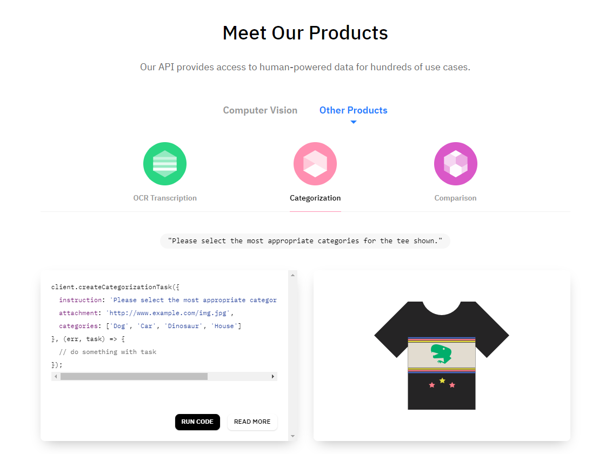

# Chapter 2 AI and Machine Learning
## 1. Personal Assistant in China
Imagine you have a personal assistant like the wealthy who handles your routine of everyday life and save your time. Now with the help of AI, this might not be just a dream. There are already several democratization providers in the US. One of them is **Fin**.

> **More powerful than a digital assistant**
>> Fin can call, email, text, schedule, research, book, and purchase for you. Talk to Fin using voice transcription that actually works. Add Fin to email chains. Fin understands context, learns your preferences, and handles nuanced requests.

> **More flexible than a traditional assistant**
>> Fin is available 24 x 7 x 365. We hire and manage a highly skilled and educated team, so you don't have to. You pay only for what you use, down to the minute.

> **Always learning and improving**
>> We review every request, learn from mistakes, and only charge for quality. Fin connects to your services and learns to better serve you over time. Fin applies what it learns from all the people it interacts with to make your experience better.

Another example is [**X.ai**](https://x.ai/how-it-works/), their AI software is set to ease the pain of scheduling for business.

The hard fact is that Fin has been suing by unhappy customers from day 1, as Fin cannot provide the quality of service it has promised. Fin has been forced to transit into a B2B business earlier 2019.

Standing at the time of 2019, as China is no longer a country full of cheap labor and the division of labor reaching the level of a developed economy, we could expect a decent growth in the demand for AI-powered personal assistants. But the major thread of this business is actually the hardness of data acquisition from both the supply and demand sides. As for demand side, Chinese major messaging tool WeChat is famous for closeness and email is not preferred by most Chinese without oversee experience, which makes even sending public notifications to clients hard without the permission of WeChat. The same difficulty for supply side comes from O2O (Online-to-offline) big players, like Meituan, Ele.me (by Alibaba). As most of the personal assistant demand is already met by their service, like food delivery, movie booking and city touring, within several taps on a customer's smartphone. To be even worse, those O2O companies do not publish their open APIs for business listings like what Yelp APIs did, which means your AI is not fed with enough data unless a mighty-illegal scraping script is running.

And you should never expect too much for AI, you have to be responsible for the quality of service provided. If needed, a dedicated well-trained team should be set up to provide on-demand service from clients. But in that case, a lower profit margin should be well-expected.

It seems that a "Jarvis" for every Chinese might still remains the Goblet of Fire for AI startups for sometime, until the next Steve Jobs maybe?

### Successful Determinants
1. Your AI program is data-abundant.
2. Be responsible for the quality and consistency of your service.
3. Maintain the business margin with high operating cost.

### Suggested Procedure
I am not confident about the success of this business, so as I cannot guaranteed the procedure below to be suggested.
1. Do product research on Fin and X.ai, make a list of categories of service they provide.
2. Do research on data acquisition from [Dianping Open platform](https://open.dianping.com/document/v2?docId=6000146&rootDocId=1000) and notification setting from [WeChat official Accounts Platform](https://mp.weixin.qq.com/), do cross-check on what service is achievable in China from the list you make in step 1.
3. Do things that don't scale! Start as a WeChat Official Account to provide assistant service and gain experience on the standardization and automation of your service. You do not want to waste time building original mobile apps as they are not as agile to test your hypothesis about a profitable business in this field.
4. As you make your customers happy, you could start your growth hacking journey, city by city. Always make sure your supply capacity is redundant to your demand so as to lower your risk of inconsistent customer satisfaction rate.
5. A promising future could be acquired by Meituan or BAT. There is a low probability for this business to be a public-listed company due to data acquisition.

## 2. Human Intelligence on Demand
Like [Scale API](https://scale.ai/), the API uses human intelligence for training data. Scale's API provides access to **human-powered** data for hundreds of use cases, including computer vision like sensor fusion, video, semantic segmentation, cuboids, polygons, 2D boxes and lines & splines, other products including OCR transcription, categorization and comparison. A similar human-powered API service (this service) could be built in China.

>**How It Works**
>>After sending us your data via API call, our platform through a combination of human work and review, smart tools, statistical confidence checks and machine learning checks returns scalable, accurate ground truth data.

We could treat this service as the last-mile problem solver of full automation. For example, at the end of the day, when you already have automated most of the image categorization duty using deep learning, those last several images that are hard to categorize could be thrown to this service for a well-expecting response. Compare to hiring an employee for any type of specific routine duty, this service provides unparalleled cost advantage, as you only pay for what you ask.

This API is going to be valuable especially in the lucrative finance industry in China. As data here is often not as structured as it is in the West, whoever could help the quantitative hedge funds do the heavy lifting of data acquisition on their demand deserves the premium from chaos to order.

### Successful Determinants
1. Win the trust of programmers by delivering instant reliable data with code-line-level API.
2. A well-trained human intelligence team.
3. A mechanism to group by similar tasks so that to reduce the redundancy of human intelligence.

### Suggested Procedure
1. Check the Scale API product list and pick one service area to get started.
1. Hire enough human intelligence to provide the service, do count yourself as the first one is recommended.
2. Wrap up your service in an API following RESTful API principles and shift it through language packaging management tools like `npm` for JavaScript or `pip` for Python.
2. Build the website with WeChat Pay and Alipay accessibility, price your service based on Scale API and similar service providers on Data Marketplace like JD WanXiang (京东万象), give free credits to new users for the test trial.
2. As the usage of API grows, encourage users to top up using Growth Hacking techniques.

## 3. AI Web Backend
Use AI to build a web app backend and auto-figure out user's requests and return an response accordingly. It matches the trend of server-less.

### Successful Determinants
TBD

### Suggested Procedure
TBD

## 4. WeChat Bot for Heterosexual Communication
Although female and male share the same language system, but we can still be confident that they speak different languages. As females are generally more emotional while males are more logical, the communication barrier does exist between them, especially for the youth having their very first love experience. It is not uncommon that we heard a couple's breakup traced back to a tiny miscommunication conflict. Girls are always complaining the stubbornness of guys and guys are tired of guessing games. Why only Pick-up Artist could be the mastery in this field? AI could exactly be your helper.

By training NLP with a sufficient amount of conversation data, the algorithm could, in real-time, judge the emotional nuances whether to be positive or negative better than human and return the hidden truly emotional attitude or even intention behind the sentences, especially from women.

To be not over-exaggerated, anyone who builds this chatbot should win the Nobel Prize for Economics, as to solve the communication barrier between one half of population to the other. Heal the world, make it a better place...

Related tools could be:
1. NLP providers:
    1. [Xiao i](http://open.xiaoi.com/)
    2. [Tuling](http://www.tuling123.com/)
2. Python module for WeChat: [wxpy](http://wxpy.readthedocs.io/zh/latest/utils.html#id3)

### Successful Determinants
1. Accessibility to WeChat's chat history. (Very hard, Tencent's top secret)

### Suggested Procedure
1. With the approval from users, use `wxpy` to capture the specific chat history and upload all sentences to a central database grouped by user segmentation.
2. Use NLP and deep learning to analyze the emotional attitude or intention behind sentences so as to return to users instantly in WeChat.
3. As more users flouring in, tune your model with more data to increase predictive accuracy.
4. Starting to make money by donation, you are expected to start charging on demand or through monthly-subscription after you could provide a proved robust service.

## 5. AI Auditor for Weibo Fake Followers
Weibo is the Chinese version of Twitter, in case you have not known by far. exactly like Twitter or Instagram, Weibo gets the cancer of fake users problem. In fact, there is a paid-likes/paid-follows chain of illegal industry underneath Weibo, which makes the auditing of Weibo profiles such an urgency. Luckily, there still remains a vacancy using AI to solve the problem.

[Instagram AI Auditor]()
For Instagram, there is already this service provider that you could use to take reference on.

### Successful Determinants
1. The data accessibility of followers list of a given Weibo profile. Current Weibo policy only allows the accessibility to the followers list of **your followers**, so for previously unconnected users it could be hard for them to audit each other.

### Suggested Procedure
1. Figure out the mechanism/algorithms the Instagram Auditor used to determine a fake user/like. You may want to register yourself as a test driver.
2. Develop a Weibo scraper to acquire the followers/likes data of any specified profile. You could start by forking [this one](##TODO) on GitHub.
3. Use AI to determine fake users from good one by one and generate a report using Instagram Auditor as an example.

## 6. AI Logo Builder

### Successful Determinants
TBD

### Suggested Procedure
TBD

## 7. AI Legal Disputer
A helper for legal tickets dispute.

### Successful Determinants
TBD

### Suggested Procedure
TBD

## 8. Sharing Economy Auto Filter Machine
Inspired by the YC's article on how to choose the right field to start a sharing economy business.

### Successful Determinants
TBD

### Suggested Procedure
TBD

## 9. Commercialisation of Autodraw
https://www.autodraw.com/

### Successful Determinants
TBD

### Suggested Procedure
TBD

## 10. Taxation Auditor
An AI-powered auditor to detect tax malfunctions like receipts with consecutive IDs.

### Successful Determinants
TBD

### Suggested Procedure
TBD

## 11. Dress Matching Automation
Help women to decide how to pair their shoes and clothes using AI.

### Successful Determinants
TBD

### Suggested Procedure
TBD

## 12. AI for Data Analytics

### Successful Determinants
TBD

### Suggested Procedure
TBD

## 13. Baby Naming Machine
AI is not only useful to name a business, but also a new-born.

### Successful Determinants
TBD

### Suggested Procedure
TBD

## 14. Cover Letter Generator
There is already a resume generator called WonderCV in China, but not for cover letter yet.

### Successful Determinants
TBD

### Suggested Procedure
TBD

## 15. Remote Jobs Recommendation by AI
Recommend suitable remote jobs based on a candidate's LinkedIn profile, hourly paid, and employers could cancel the contract to protect their best interests. A sample could be [Romote Job Lists](https://www.remotejoblists.com/).

### Successful Determinants
TBD

### Suggested Procedure
TBD

## 16. Scholar Paper Reader
Auto-extract keywords from papers.

### Successful Determinants
TBD

### Suggested Procedure
TBD
