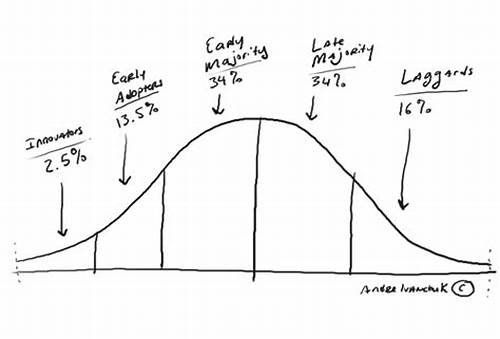

# Reference
#TODO

## Money Transfer
Chinese to USD, TBD

## Why copycat models work in China?
Cultural Distinction creates Barrier.

## Why WeChat Public Account instead of your Website?
Audience reaching, user habit difference.

## Do Chinese programmers program in Chinese or English?
Universal.
https://www.quora.com/Do-Chinese-programmers-program-in-Chinese-or-English

## Why some ideas have prototypes but others don't?
Because some ideas are brand-new, conceptual or complicated. Without a prototype, readers might find it hard to execute or grasp the full picture.

## When you are redirected to a Chinese website, how should you translate the page?
Right click on any part of the webpage and select `Translate to English`.

## Prototype pricing strategy
Based on the development time involved, value of the prototype.

## The Law of the Diffusion of Innovation

